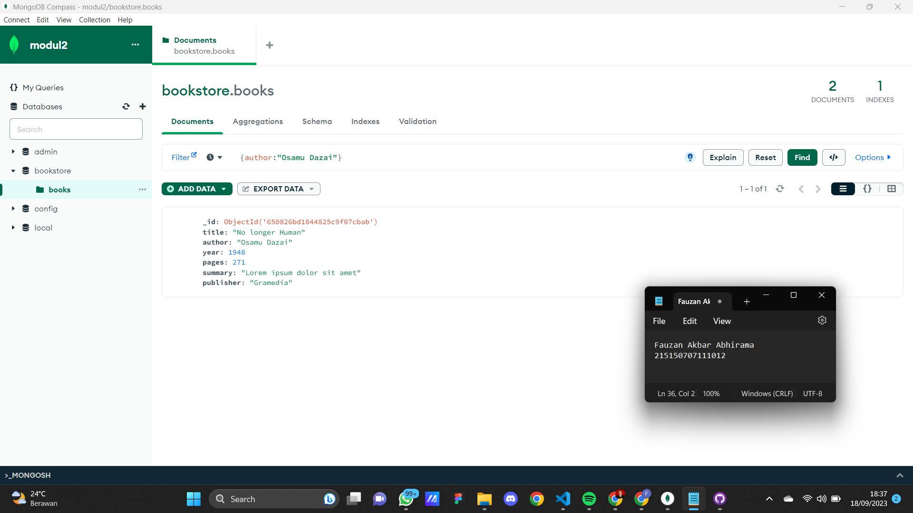
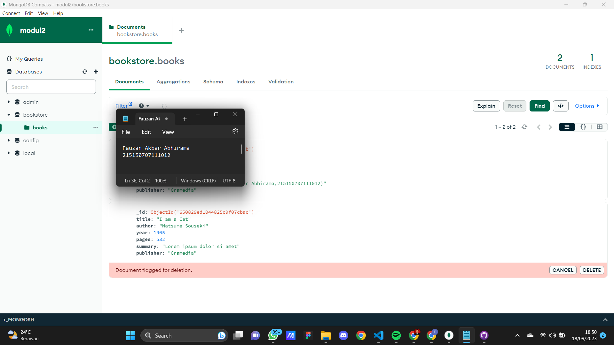
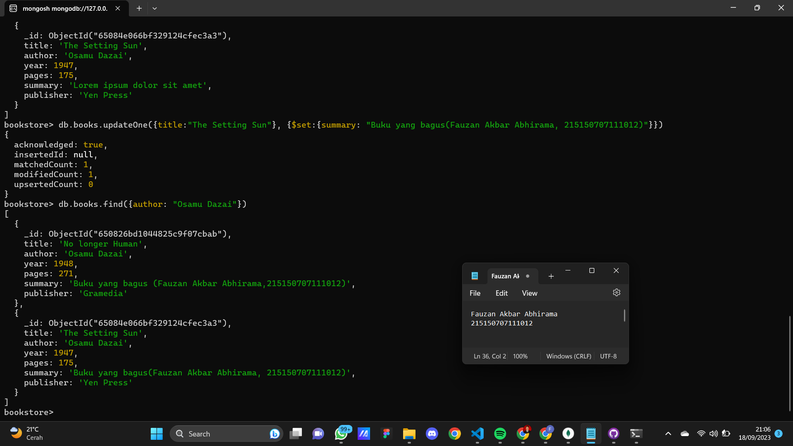

## MongoDB Compass
1. Melakukan koneksi ke MongoDB menggunakan connection string dengan tidak menggunakan mangodb atlas. <br />

2. Membuat database dengan melakukan klik “Create Database”. <br />

3. Melakukan insert buku pertama dengan melakukan klik “Add Data”, pilih “Insert
Document”, isi dengan data yang diinginkan dan klik “Insert”. <br />
Source Code :<br />
```
/** 
* Paste one or more documents here
*/
{
  "_id": {
    "$oid": "650826bd1044825c9f07cbab"
  },
  "title":"No longer Human",
  "author":"Osamu Dazai",
  "year":1948,
  "pages":271,
  "summary":"Lorem ipsum dolor sit amet",
  "publisher":"Gramedia"
}
``` 
Screenshot : <br />

4. Melakukan insert buku kedua dengan cara yang sama. <br />
Source Code :<br />
```
/** 
* Paste one or more documents here
*/
{
  "_id": {
    "$oid": "650829ed1044825c9f07cbac"
  },
  "title": "I am a Cat",
  "author": "Natsume Souseki",
  "year": 1905,
  "pages": 532,
  "summary": "Lorem ipsum dolor si amet",
  "publisher":"Gramedia"
}
``` 
Screenshot : <br />
<br />
5. Melakukan pencarian buku dengan author “Osamu Dazai” dengan mengisi filter yang
diinginkan dan klik “Find” <br />
<br />
6. Melakukan perubahan summary pada buku “No Longer Human” menjadi “Buku yang
bagus (<NAMA>,<NIM>) dengan melakukan klik “Edit Document” (berlambang
pensil), mengisi nilai summary yang baru, dan melakukan klik “Update” <br />
<br />
7. Lakukan penghapusan pada buku “I Am a Cat” dengan melakukan klik “Remove
Document” (berlambang tong sampah) dan melakukan klik “Delete” <br />
<br />
## MongoDB Shell
1. Melakukan koneksi ke MongoDB Server dengan menjalankan command mongosh bagi
yang menggunakan terminal build in OS sehingga tampilan terminal kalian akan
menjadi seperti berikut<br />
<br />
2. Mencoba melihat list database yang ada di server dengan menjalankan command
show dbs<br />
<br />
Untuk berpindah ke database “bookstore” gunakan command use bookstore , kalian
dapat memastikan telah berpindah ke database yang benar dengan melihat tulisan
sebelum tanda “>” <br />
<br />
Cobalah untuk melihat collection yang ada pada database tersebut dengan
menggunakan command show collections <br />
<br />
3. Lakukan insert buku “Overlord I” dengan menggunakan command
db.books.insertOne(<data kalian>) , setelah insert buku berhasil maka MongoDB akan
mengembalikan pesan sebagai berikut. <br />
Source Code :<br />
```
db.books.insertOne({title:"Overlord I", author:"Kugane Maruyama", year: 2012, pages: 548, summary: "Lorem ipsum dolor sit amet",publisher:"Yen Press"})
``` 
Screenshot : <br />
<br />
4. Lakukan insert buku “The Setting Sun” dan “Hujan” dengan insert many dengan
menggunakan command db.books.insertMany(<data kalian>) , dan akan
CRUD MongoDB Compass dan Shell 9
mengembalikan pesan sebagai berikut. <br />
Source Code :<br />
```
db.books.insertMany([{title:"The Setting Sun", author:"Osamu Dazai", year: 1947, pages: 175, summary: "Lorem ipsum dolor sit amet",publisher:"Yen Press"}, {title:"Hujan", author:"Tere Liye", year: 2016, pages: 320, summary: "Lorem ipsum dolor sit amet",publisher:"Gramedia"}])
``` 
Screenshot : <br />
<br />
5. Melakukan pencarian buku dengan menggunakan command db.books.find() untuk
melakukan pencarian semua buku.
<br />
6. Tampilkan seluruh buku dengan author “Osamu Dazai” dengan mengisi argument
pada find() dengan menggunakan command db.books.find({<filter yang ingin
diisi>}) <br />
<br />
7. Melakukan perubahan summary pada buku “Hujan” menjadi “Buku yang bagus
(<NAMA>,<NIM>) dengan mengunakan command db.books.updateOne({<filter>},
{$set: {<data yang akan di update>}}) sehingga output yang dihasilkan oleh MongoDB
akan menjadi seperti berikut <br />
<br />
8. Melakukan perubahan publisher menjadi “Yen Press” pada semua buku “Osamu
Dazai” dengan menggunakan command db.books.updateMany({<filter>}, {$set: {<data
yang akan di update>}})<br />
<br />
9. Melakukan penghapusan pada buku “Overlord I” dengan menggunakan command
db.books.deleteOne({<argument>})<br />
<br />
10.Melakukan penghapusan pada semua buku “Osamu Dazai dengan menggunakan
command db.books.deleteMany({<argument>})<br />
<br />


