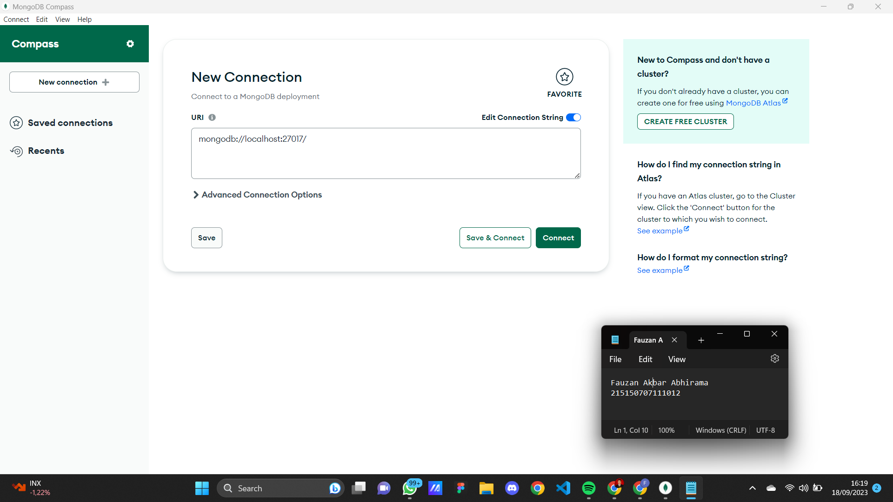

1. Melakukan koneksi ke MongoDB menggunakan connection string dengan tidak menggunakan mangodb atlas. <br />

2. Membuat database dengan melakukan klik “Create Database”. <br />

3. Melakukan insert buku pertama dengan melakukan klik “Add Data”, pilih “Insert
Document”, isi dengan data yang diinginkan dan klik “Insert”. <br /><br />
Source Code :<br />
```
/** 
* Paste one or more documents here
*/
{
  "_id": {
    "$oid": "650826bd1044825c9f07cbab"
  },
  "title":"No longer Human",
  "author":"Osamu Dazai",
  "year":1948,
  "pages":271,
  "summary":"Lorem ipsum dolor sit amet",
  "publisher":"Gramedia"
}
``` 
Screenshot : <br />

4. Melakukan insert buku kedua dengan cara yang sama. <br />

