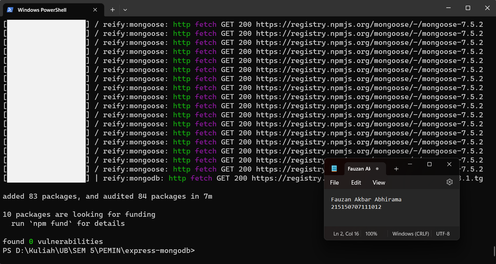
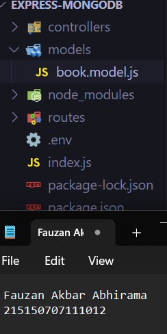

## Percobaan instalasi NodeJS
1. Mendownload dan menjalankan node setup<br />
<br />
2. Menjalankan command node -v untuk memeriksa apakah
NodeJS sudah terinstall<br />
<br />
## Inisiasi project Express dan pemasangan package
1. Melakukan pembuatan folder dengan nama express-mongodb dan masuk ke dalam folder tersebut lalu buka melalui text editor masing-masing
<br />
2. Melakukan npm init untuk mengenerate file package.json dengan menggunakan command npm init -y
<br />
3. Lakukan instalasi express, mongoose, dan dotenv dengan menggunakan command npm i express mongoose dotenv<br/>
<br />
## Koneksi Express ke MongoDB
1. Buatlah file index.js pada root folder dan masukkan kode di bawah ini<br />
Source Code:
```
require('dotenv').config();
const express = require('express');
const mongoose = require('mongoose');
const app = express();
app.use(express.json());
app.get('/', (req, res) => {
res.status(200).json({
message: '<nama>,<nim>'
})
})
const PORT = 8000;
app.listen(PORT, () => {
console.log(`Running on port ${PORT}`);
})
```
Screenshot : <br />
<br/>
2. Lakukan pembuatan file .env dan masukkan baris berikut <br />
Source Code:
```
PORT=5000
```
Screenshot : <br />
<br/>
Setelah itu ubahlah kode pada listening port menjadi berikut dan coba jalankan aplikasi
kembali<br /><br />
Source Code:
```
...
const PORT = process.env.PORT || 8000;
app.listen(PORT, () => {
console.log(`Running on port ${PORT}`);
})
```

Screenshot : <br />


3. mengcopy connection string yang terdapat pada compas atau atlas dan paste kan pada
.env seperti berikut<br/>
Source Code:
```
MONGO_URI=l27.0.0.1:27017
```
Screenshot : <br />

4. Tambahkan baris kode berikut pada file index.js<br />
Source Code:
```
require('dotenv').config();
const express = require('express');
const mongoose = require('mongoose');
mongoose.connect(process.env.MONGO_URI);
const db = mongoose.connection;
db.on('error', (error) => {
console.log(error);
});
db.once('connected', () => {
console.log('Mongo connected');
})
...
```

Screenshot : <br />

Setelah itu coba jalankan aplikasi kembali

## Pembuatan routing
1. Melakukan pembuatan direktori routes di tingkat yang sama dengan index.js dan membuat file book.route.js di dalamnya<br />
<br />

3. Tambahkan baris kode berikut untuk fungsi getAllBooks<br />
Source Code:
```
const router = require('express').Router();
router.get('/', function getAllBooks(req, res) {
res.status(200).json({
message: 'mendapatkan semua buku'
})
})
module.exports = router;
```

Screenshot : <br />

4. Lakukan hal yang sama untuk getOneBook, createBook, updateBook, dan deleteBook<br />
Source Code:
```
const router = require('express').Router();
...
router.get('/:id', function getOneBook(req, res) {
const id = req.params.id;
res.status(200).json({
message: 'mendapatkan satu buku',
id,
})
})
router.post('/', function createBook(req, res) {res.status(200).json({
message: 'membuat buku baru'
})
})
router.put('/:id', function updateBook(req, res) {
const id = req.params.id;
res.status(200).json({
message: 'memperbaharui satu buku',
id,
})
})
router.delete('/:id', function deleteBook(req, res) {
const id = req.params.id;
res.status(200).json({
message: 'menghapus satu buku',
id,
})
})
module.exports = router;
```

Screenshot : <br />

5. Lakukan import book.route.js pada file index.js dan tambahkan baris kode berikut<br />
Source Code:
```
require('dotenv').config();
const express = require('express');
const mongoose = require('mongoose');
const bookRoutes = require('./routes/book.route'); //
...
app.get('/', (req, res) => {
res.status(200).json({
message: '<nama>,<nim>'
})
})
app.use('/books', bookRoutes); //
const PORT = process.env.PORT || 8000;
app.listen(PORT, () => {
console.log(`Running on port ${PORT}`);
})
```

Screenshot : <br />

6. Uji salah satu end point dengan postman <br />

## Pembuatan Controller
1. Lakukan pembuatan direktori controllers di tingkat yang sama dengan index.js dan membuat file book.controller.js di dalamnya <br />

2. Salin baris kode dari routes untuk fungsi getAllBooks<br />
Source Code:
```
function getAllBooks(req, res) {
res.status(200).json({
message: 'mendapatkan semua buku'
})
};
module.exports = {
getAllBooks,
}
```
Screenshot :

3. Lakukan hal yang sama untuk getOneBook, createBook, updateBook, dan deleteBook<br />
Source Code:<br/ >
```
...
function getOneBook(req, res) {
const id = req.params.id;
res.status(200).json({
message: 'mendapatkan satu buku',
id,
})
}
function createBook(req, res) {
res.status(200).json({
message: 'membuat buku baru'
})
}
function updateBook(req, res) {
const id = req.params.id;
res.status(200).json({
message: 'memperbaharui satu buku',
id,
})
}
function deleteBook(req, res) {
const id = req.params.id;
res.status(200).json({
message: 'menghapus satu buku',
id,
})
}
module.exports = {
getAllBooks,
getOneBook, //
createBook, //
updateBook, //
deleteBook //
}
```
Screenshot : <br />

4. Lakukan import book.controller.js pada file book.route.js<br />
Source Code:
```
const router = require('express').Router();
const book = require('../controllers/book.controller'); //
...
module.exports = router;
```

Screenshot : <br />

5. Lakukan perubahan pada fungsi agar dapat memanggil fungsi dari book.controller.js<br />
Source Code:
```
const router = require('express').Router();
const book = require('../controllers/book.controller');
router.get('/', book.getAllBooks);
router.get('/:id', book.getOneBook);
router.post('/', book.createBook);
router.put('/:id', book.updateBook);
router.delete('/:id', book.deleteBook);
module.exports = router;
```

Screenshot : <br />

6. Lakukan pengujian kembali, pastikan response tetap sama <br />

## Pembuatan Model
Berikut adalah gambaran bentuk data dari modul sebelumnya<br />
<table>
 	<tr>
 		<td> title </td>
 		<td> string </td>
 	</tr>
 	<tr>
 		<td> author </td>
 		<td> string </td>
 	</tr>
  <tr>
 		<td> year </td>
 		<td> number </td>
 	</tr>
  <tr>
 		<td> pages </td>
 		<td> number </td>
 	</tr>
  <tr>
 		<td> summary </td>
 		<td> string </td>
 	</tr>
  <tr>
 		<td> publisher </td>
 		<td> string </td>
 	</tr>
 </table>
 
1. Lakukan pembuatan direktori models di tingkat yang sama dengan index.js dan membuat file book.model.js di dalamnya <br />

2. Tambahkan baris kode berikut sesuai dengan tabel di atas<br />
Source Code:
```
const mongoose = require('mongoose');
const bookSchema = new mongoose.Schema({
title: {
type: String
},
author: {
type: String
},
year: {
type: Number
},
pages: {
type: Number
},
summary: {
type: String
},
publisher: {
type: String
}
})
module.exports = mongoose.model('book', bookSchema);
```
Screenshot : <br />

## Operasi CRUD
1. Hapus semua data pada collection books <br />

2. Lakukan import book.model.js pada file book.controller.js<br />
Source Code:
```
const Book = require('../models/book.model');
...
```
Screenshot : <br />

3. Lakukan perubahan pada fungsi createBook<br />
Source Code:
```
const Book = require('../models/book.model');
...
async function createBook(req, res) {
const book = new Book({
title: req.body.title,
author: req.body.author,
year: req.body.year,
pages: req.body.pages,
summary: req.body.summary,
publisher: req.body.publisher,
})
try {
const savedBook = await book.save();
res.status(200).json({
message: 'membuat buku baru',
book: savedBook,})
} catch (error) {
res.status(500).json({
message: 'kesalahan pada server',
error: error.message,
})
}
}
...
```
Screenshot : <br />

4. Buatlah dua buah buku dengan data di bawah ini dengan Postman
Source Code:
```
{
"title": "Dilan 1990",
"author": "Pidi Baiq",
"year": 2014,
"pages": 332,
"summary": "Mirea, anata wa utsukushī",
"publisher": "Pastel Books"
}
```
```
{
"title": "Dilan 1991",
"author": "Pidi Baiq",
"year": 2015,
"pages": 344,
"summary": "Watashi ga kare o aishite iru to ittara",
"publisher": "Pastel Books"
}
```
Screenshot : <br />

5. Lakukan perubahan pada fungsi getAllBooks<br />
Source Code:
```
const Book = require('../models/book.model');
async function getAllBooks(req, res) {
try {
const books = await Book.find();
res.status(200).json({
message: 'mendapatkan semua buku',
books,
})
} catch (error) {
res.status(500).json({
message: 'kesalahan pada server',
error: error.message,})
	}
}
...
```
Screenshot : <br />

6. Lakukan perubahan pada fungsi getOneBook<br />
Source Code:
```
const Book = require('../models/book.model');
...
async function getOneBook(req, res) {
const id = req.params.id;
try {
const book = await Book.findById(id);
res.status(200).json({
message: 'mendapatkan satu buku',
book,
})
} catch (error) {
res.status(500).json({
message: 'kesalahan pada server',
error: error.message,
})
}
}
...
```

Screenshot :

7. Tampilkan semua buku dengan post man <br />

8. Tampilkan buku Dilan 1990 dengan Postman<br />

9. Melakukan perubahan pada fungsi updateBook<br />
Source Code:
```
const Book = require('../models/book.model');
...
async function updateBook(req, res) {
const id = req.params.id;
try {
const book = await Book.findByIdAndUpdate(
id, req.body, { new: true }
)
res.status(200).json({
message: 'memperbaharui satu buku',
book,
})
} catch (error) {
res.status(500).json({
message: 'kesalahan pada server',
error: error.message,
})
}
}
...
```
Screenshot : <br />

10. Ubah judul buku Dilan 1991 menjadi NAMA PANGGILAN 1991 dengan Postman<br />

11. Melakukan perubahan pada fungsi deleteBook<br />
Source Code:
```
const Book = require('../models/book.model');
...
async function updateBook(req, res) {
const id = req.params.id;
try {
const book = await Book.findByIdAndUpdate(
id, req.body, { new: true }
)
res.status(200).json({
message: 'memperbaharui satu buku',
book,
})
} catch (error) {
res.status(500).json({
message: 'kesalahan pada server',
error: error.message,
})
}
}
...
```

Screenshot : <br />

12. Hapus buku Dilan 1990 dengan Postman<br />


