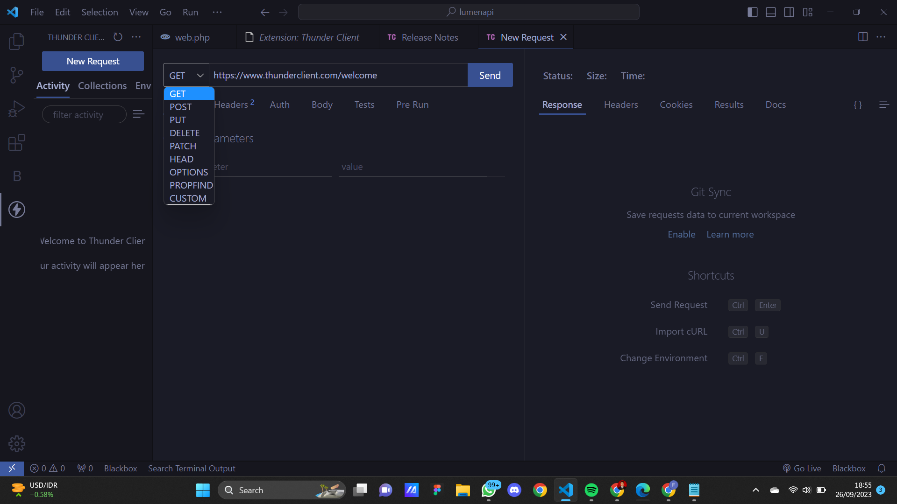

## Basic Routing dan Migration
1. GET<br />Untuk menambahkan endpoint dengan method GET pada aplikasi kita, kita dapat
mengunjungi file web.php pada folder routes. Kemudian tambahkan baris ini pada akhir
file<br /><br />
Source Code:
```
$router->get('/get', function () {
return 'GET';
});
```
Screenshot : <br />
<br/>
Setelah itu coba jalankan aplikasi dengan command,<br /><br />
Source Code:
```
php -S localhost:8000 -t public
```
Screenshot : <br />
<br />
<br />
<br /><br />
2. POST, PUT, PATCH, DELETE, dan OPTIONS<br/>Sama halnya saat menambahkan method GET, kita dapat menambahkan methode
POST, PUT, PATCH, DELETE, dan OPTIONS pada file web.php dengan code seperti
ini,<br /><br/>
Source Code:
```
...
$router->post('/post', function () {
return 'POST';
});
$router->put('/put', function () {
return 'PUT';
});
$router->patch('/patch', function () {
return 'PATCH';
});
$router->delete('/delete', function () {
return 'DELETE';
});
$router->options('/options', function () {
return 'OPTIONS';
});
```
Screenshot : <br />
<br/><br />
Setelah selesai menambahkan route untuk method POST, PUT, PATCH, DELETE, dan
OPTIONS, kita dapat menjalankan server seperti pada saat percobaan GET. Setelah
server berhasil menyala, kita dapat membuka aplikasi Postman atau Insomnia atau kita
juga dapat menggunakan PowerShell (Windows) / Terminal (Linux atau Mac) untuk
melakukan request ke server. Namun, pada percobaan kali ini kita akan menggunakan
extensions pada VSCode yaitu Thunder Client.<br/><br/>
a. Kita dapat menginstall ekstensi dengan membuka panel extensions lalu mencari thunder client<br />
Screenshot : <br />
<br/>
b. Setelah menginstall Thunder Client, kita akan melihat logo seperti petir pada activity bar kita (sebelah kiri).<br /><br />
c. Kita dapat membuat request dengan menekan "New Request" pada ekstensi<br />
<br/>
d. Setelah itu kita dapat memasukkan method dan url yang dituju<br />
<br/>
e. Akses url yang baru saja ditambahkan pada aplikasi dengan methodnya<br />
<br/>
<br/><br />
3. Migrasi Database<br/>
a. Sebelum melakukan migrasi database pastikan server database aktif kemudian pastikan sudah membuat database dengan nama lumenapi<br />
Screenshot : <br />
<br/>
b. Kemudian ubah konfigurasi database pada file .env menjadi seperti ini<br />
Source Code:
```
DB_CONNECTION=mysql
DB_HOST=127.0.0.1
DB_PORT=3306
DB_DATABASE=lumenapi
DB_USERNAME=root
DB_PASSWORD=
```
Screenshot : <br />
<br />
c. Setelah mengubah konfigurasi pada file .env, kita juga perlu menghidupkan
beberapa library bawaan dari lumen dengan membuka file app.php pada folder
bootstrap dan mengubah baris ini,<br />
```
//$app->withFacades();
//$app->withEloquent();
```
Menjadi,
```
$app->withFacades();
$app->withEloquent();
```
Screenshot : <br />
<br />
d. Setelah itu jalankan command berikut untuk membuat file migration,
```
php artisan make:migration create_users_table # membuat migrasi untuk tabel users
php artisan make:migration create_products_table # membuat migrasi untuk tabel products
```
Screenshot : <br />
<br />
Setelah menjalankan 2 syntax diatas akan terbuat 2 file pada folder database/migrations dengan format YYYY_MM_DD_HHmmss_nama_migrasi. Pada file migrasi kita akan menemukan fungsi up() dan fungsi down(), fungsi up() akan digunakan pada saat kita melakukan migrasi, fungsi down() akan digunakan saat kita ingin me-rollback migrasi<br /><br />
e. Ubah fungsi up pada file migrasi create_users_table<br />
Source Code:
```
# sebelumnya
...
public function up()
{
Schema::create('users', function (Blueprint $table) {
$table->id();
$table->timestamps();
});
}
...
# diubah menjadi
...
public function up()
{
Schema::create('users', function (Blueprint $table) {
$table->id();
$table->timestamps();
$table->string('name');
$table->string('email');
$table->string('password');
});

}
...
```
Screenshot : <br />
<br />
f. Ubah fungsi up pada file migrasi create_products_table<br />
Source Code:
```
# sebelumnya
...
public function up()
{
Schema::create('products', function (Blueprint $table) {
$table->id();
$table->timestamps();
});
}
...
# diubah menjadi
...
public function up()
{
Schema::create('products', function (Blueprint $table) {
$table->id();
$table->timestamps();
$table->string('name');
$table->integer('category_id');
$table->string('slug');
$table->integer('price');
$table->integer('weight');
$table->text('description');
});
}
...
```
Screenshot : <br />
<br />
g. Kemudian jalankan command,
```
php artisan migrate
```
Screenshot : <br />
<br />


