## Dynamic Route dan Middleware
1. Dynamic Route<br />Dynamic route adalah route yang dapat berubah-ubah, contohnya pada saat kita membuka
suatu halaman web, kadang kita melihat /users/1 atau /users/2 , hal ini yang dinamakan
dynamic routes.<br /><br />
Untuk menambahkan dynamic routes pada aplikasi lumen kita, kita dapat menggunakan
syntax berikut,<br /><br />
Source Code:
```
$router->get('/user/{id}', function ($id) {
return 'User Id = ' . $id;
});
```
Screenshot : <br />
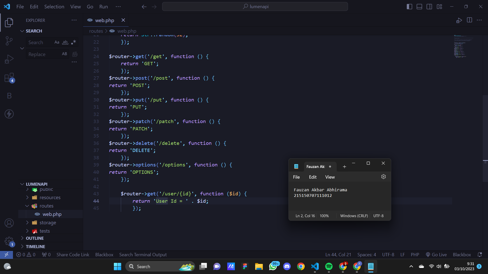<br/>
Setelah itu menjalankan localhost,<br />
Screenshot : <br />
<br/>

Saat menambahkan parameter pada routes, kita tidak terbatas pada 1 variable saja, namun
kita dapat menambahkan sebanyak yang diperlukan seperti kode berikut,
```
$router->get('/post/{postId}/comments/{commentId}', function ($postId, $commentId) {
return 'Post ID = ' . $postId . ' Comments ID = ' . $commentId;
});
```
Screenshot : <br />
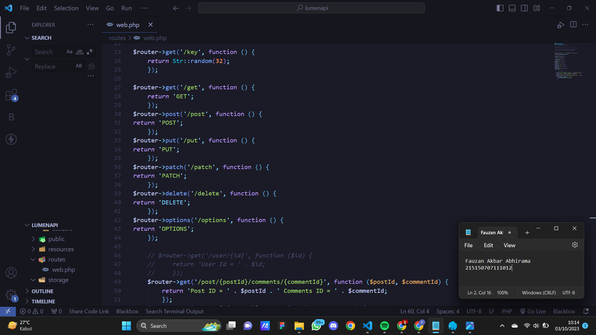<br/>
Setelah itu menjalankan localhost,<br />
Screenshot : <br />
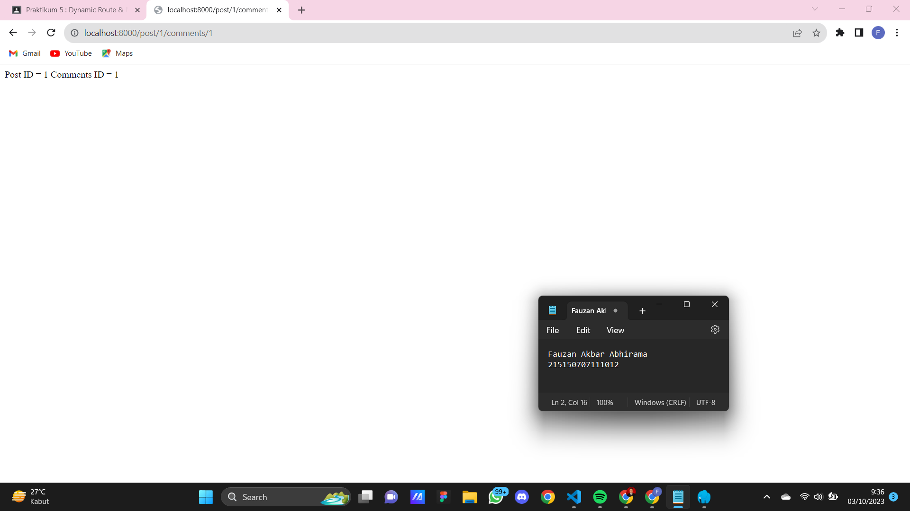<br/>
Pada dynamic routes kita juga bisa menambahkan optional routes, yang mana optional
routes tidak mengharuskan kita untuk memberi variable pada endpoint kita, namun saat kita
memanggil endpoint, dapat menggunakan parameter variable ataupun tidak, seperti pada
kode dibawah ini,
Source Code : <br />
```
$router->get('/users[/{userId}]', function ($userId = null) {
return $userId === null ? 'Data semua users' : 'Data user dengan id ' . $userId;
});
```
Screenshot : <br />
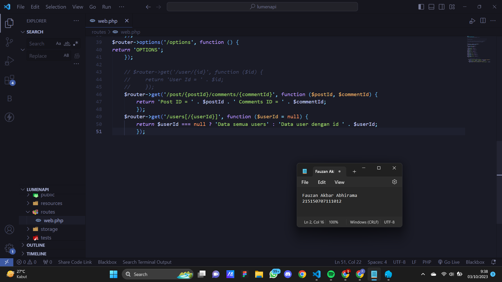<br/>
Setelah itu menjalankan localhost,<br />
Screenshot : <br />
<br/>
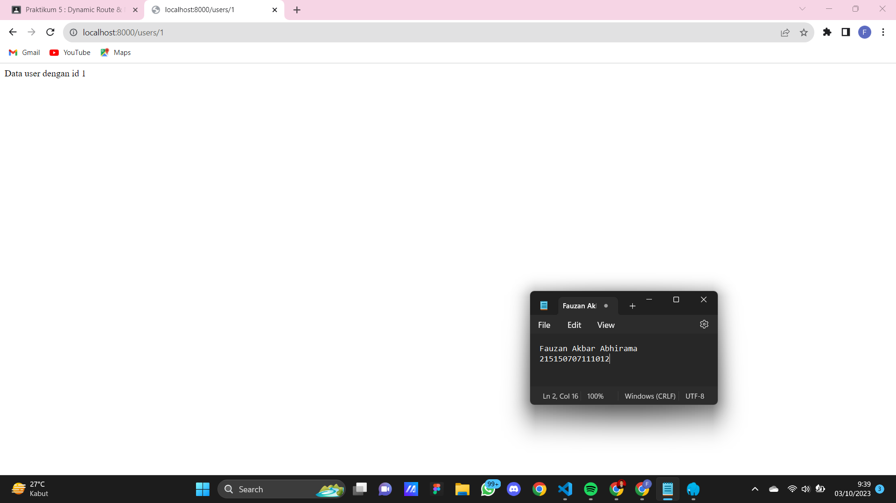<br/>
2. Aliases Route<br/>Aliases Route digunakan untuk memberi nama pada route yang telah kita buat, hal ini dapat
membantu kita, saat kita ingin memanggil route tersebut pada aplikasi kita. Berikut syntax
untuk menambahkan aliases route<br /><br/>
Source Code:
```
$router->get('/auth/login', ['as' => 'route.auth.login', function (...) {...}])
...
$router->get('/profile', function (Request $request) {
if ($request->isLoggedIn) {
return redirect()->route('route.auth.login');
}
});
```
Screenshot : <br />
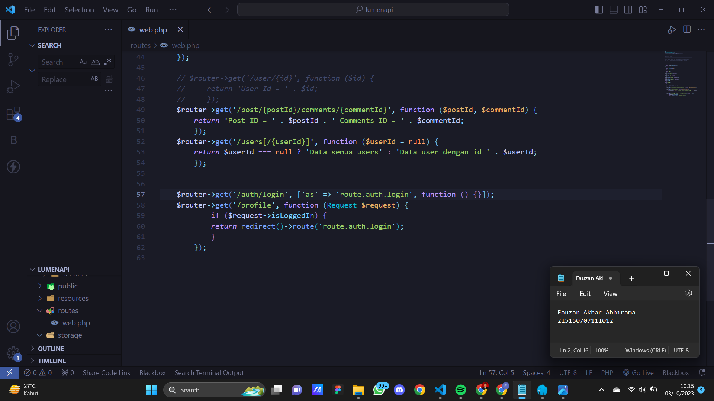<br/><br />
Setelah itu menjalankan localhost,<br />
Screenshot : <br />
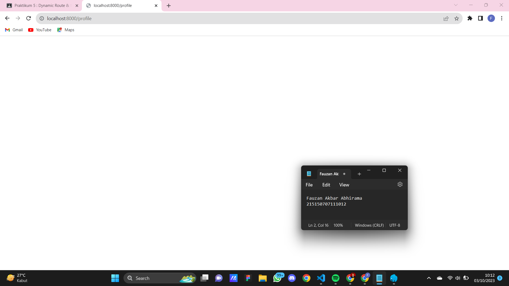<br/>
3. Group Route<br/>Pada lumen, kita juga dapat memberikan grouping pada routes kita agar lebih mudah pada
saat penulisan route pada web.php kita. Kita dapat melakukan grouping dengan
menggunakan syntax berikut,<br /><br/>
Source Code:
```
$router->group(['prefix' => 'users'], function () use ($router) {
$router->get('/', function () { // menjadi /users/, /users => prefix, / => path
return "GET /users";
});
});
```
Screenshot : <br />
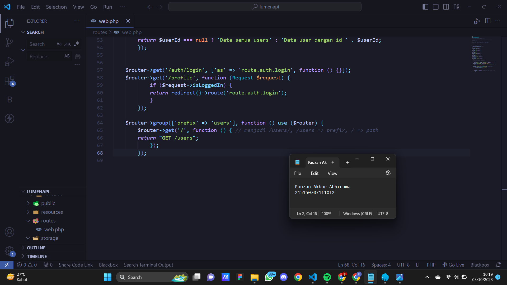<br/><br />
Setelah itu menjalankan localhost,<br />
Screenshot : <br />
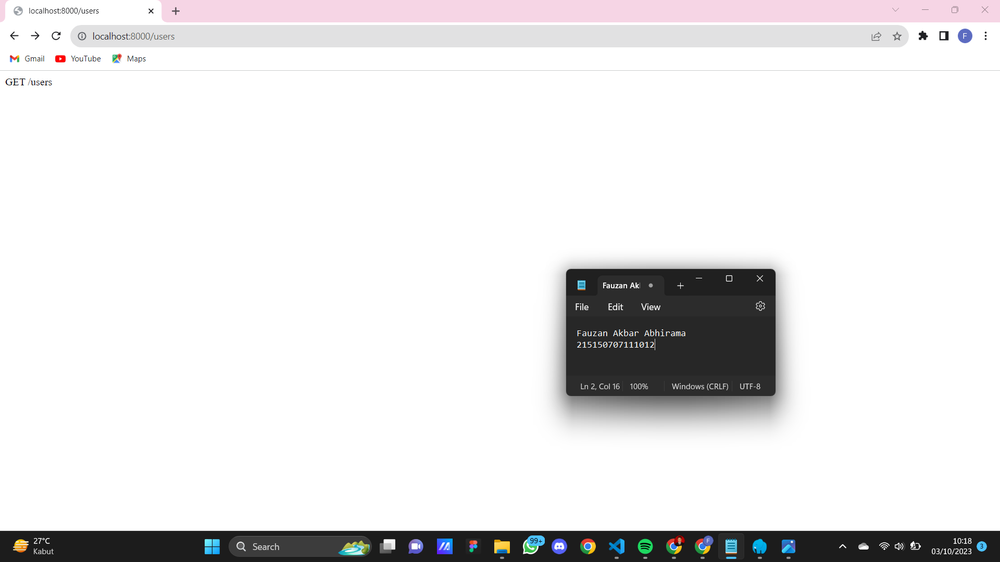<br/>
Selain dapat mengelompokkan prefix, kita juga dapat mengelompokkan middleware dan
namespace pada kelompok routes kita.<br /><br />
4. Middleware<br />Middleware adalah penengah antara komunikasi aplikasi dan client. Middleware biasanya
digunakan untuk membatasi siapa yang dapat berinteraksi dengan aplikasi kita dan
semacamnya, kita dapat menambahkan middleware dengan menambahkan file pada folder app/Http/Middleware . Pada folder tersebut terdapat file ExampleMiddleware , kita dapat men-
copy file tersebut untuk membuat middleware baru.<br /><br />
Pada praktikum kali ini akan dibuat middleware Age dengan isi,<br /><br />
Source Code:
```
<?php
namespace App\Http\Middleware;
use Closure;
class AgeMiddleware
{
/**
* Handle an incoming request.
*
* @param \Illuminate\Http\Request $request
* @param \Closure $next
* @return mixed
*/
public function handle($request, Closure $next)
{
if ($request->age < 17)
return redirect('/fail');
return $next($request);
}
}
```
Screenshot : <br />
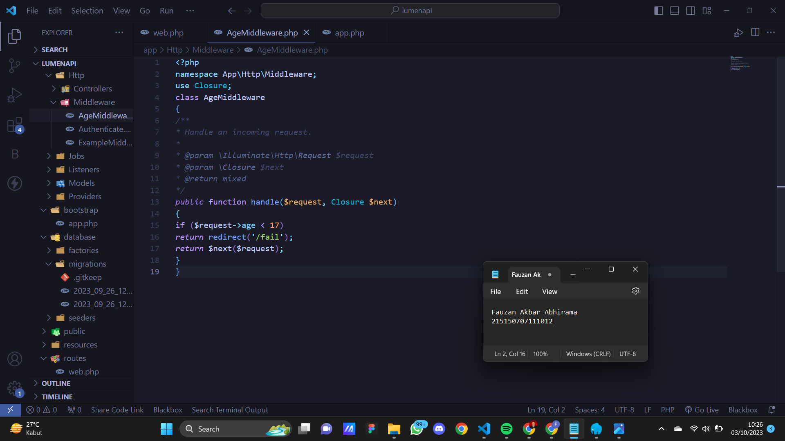<br/>

Kemudian, setelah menambahkan filter pada AgeMiddleware , kita harus mendaftarkan
AgeMiddleware pada aplikasi kita, pada file bootstrap/app.php seperti berikut ini,
```
$router->get('/post/{postId}/comments/{commentId}', 73 ...
74
75 // $app->middleware([
76 // App\Http\Middleware\ExampleMiddleware::class
77 // ]);
78
79 $app->routeMiddleware([
80 // 'auth' => App\Http\Middleware\Authenticate::class,
81 'age' => App\Http\Middleware\AgeMiddleware::class
82 ]);
83
84 ...
```
Screenshot : <br />
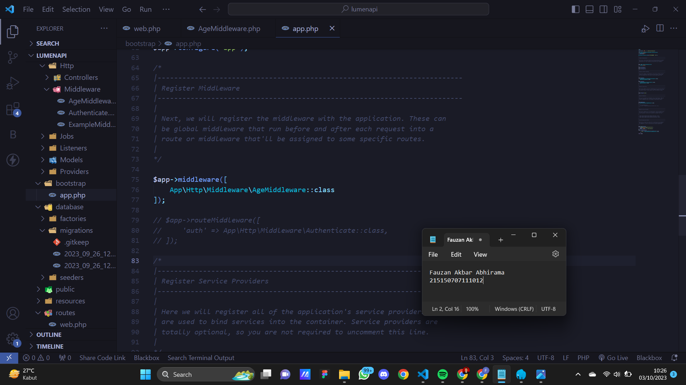<br/>
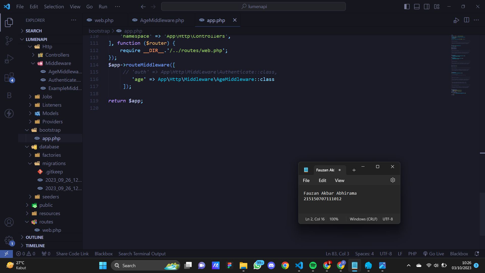<br/>
Pada baris 65 terdapat comment mengenai proses mendaftarkan suatu middleware dalam
aplikasi kita. Untuk menambahkan middleware pada aplikasi kita, kita dapat men-
uncomment baris 75 hingga 77, kemudian menambahkan age middleware ke dalamnya.

Namun, karena kita hanya ingin menambahkan middleware pada route tertentu, kita akan
menghapus comment pada baris 79 hingga 81, kemudian menambahkan middleware age di
dalamnya.
Lalu, kita dapat menambahkan middleware pada routes kita dengan menambahkan opsi
middleware pada salah satu route, contohnya,<br>
Source Code : <br />
```
$router->get('/admin/home/', ['middleware' => 'age', function () {
return 'Dewasa';
}]);
$router->get('/fail', function () {
return 'Dibawah umur';
});
```
Screenshot : <br />
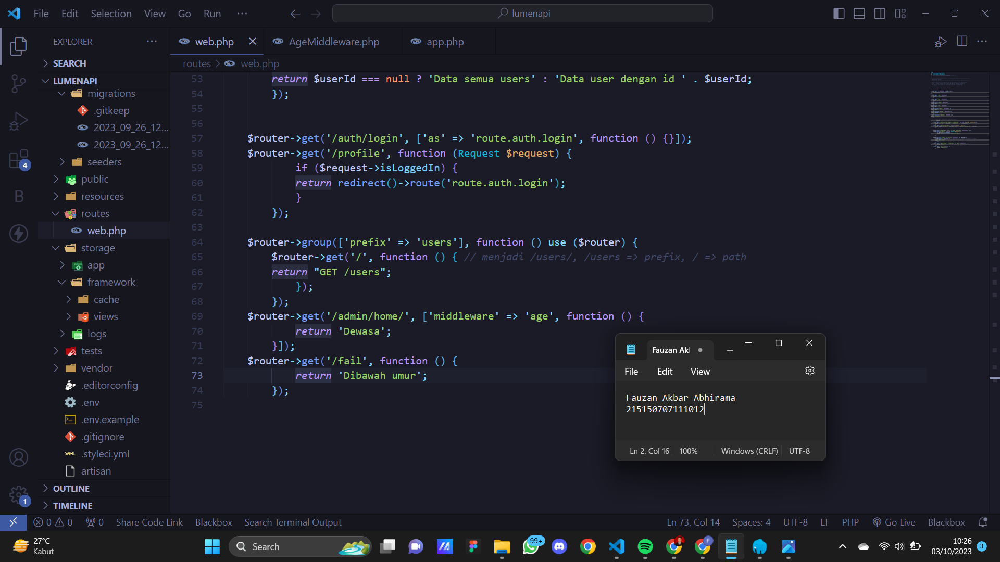<br/>
Setelah itu menjalankan localhost,<br />
Screenshot : <br />
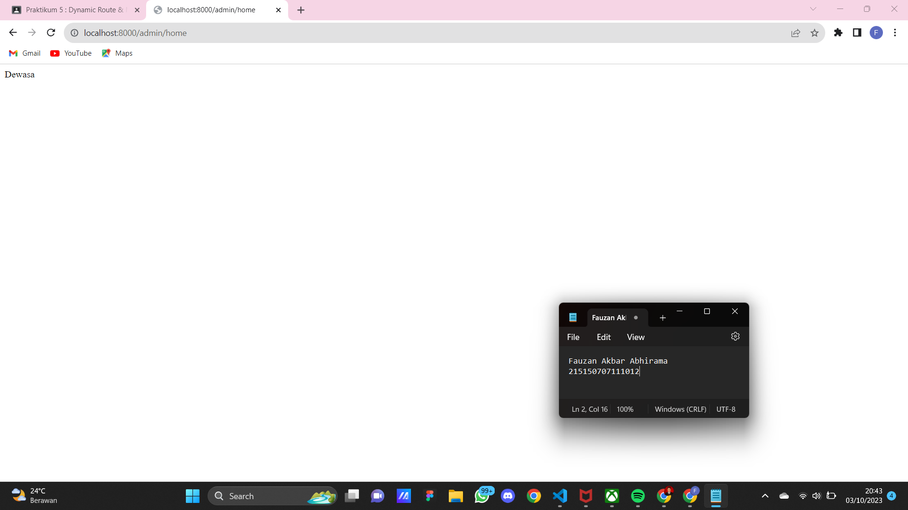<br/>


