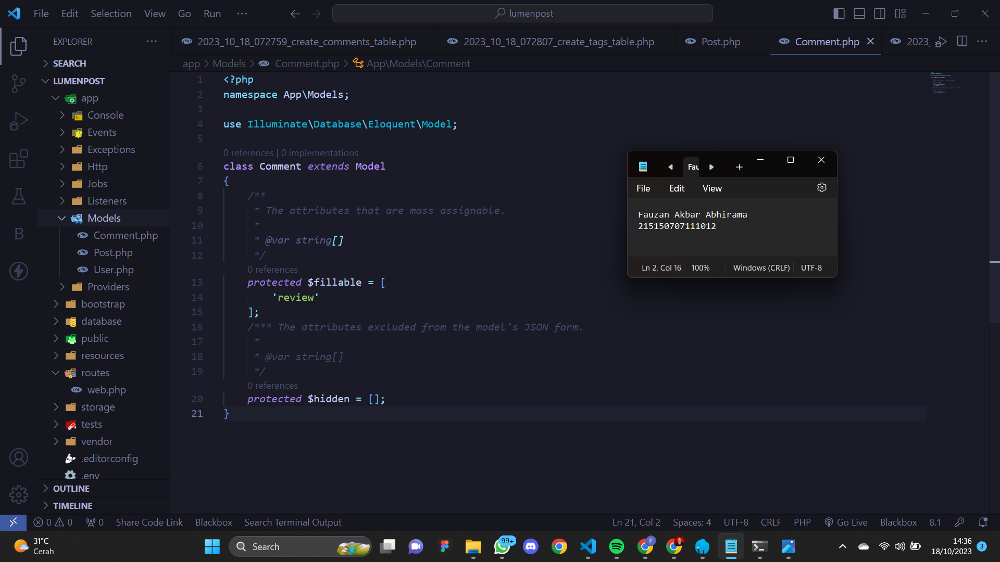

# Relasi One-to-Many dan Many-to-Many
## Pembuatan Tabel<br />
Berikut adalah tabel yang akan digunakan pada percobaan ini
<table>
 	<tr>
 		<td> posts </td>
		<td> comments </td>
		<td> tags </td>
		<td> post_tag </td>
 	</tr>
 	<tr>
 		<td> id </td>
		<td> id </td>
		<td> id </td>
		<td> postId </td>
 	</tr>
  <tr>
 		<td> content(STRING) </td>
		<td> review(STRING) </td>
		<td> name </td>
		<td> tagId </td>
 	</tr>
  
  
 </table><br />
1. Sebelum membuat migrasi database atau membuat tabel pastikan server database
aktif kemudian pastikan sudah membuat database dengan nama<br />

Screenshot : <br />
<br/><br />
2. Kemudian ubah konfigurasi database pada file .env menjadi seperti berikut
```
DB_CONNECTION=mysql
DB_HOST=127.0.0.1
DB_PORT=3306
DB_DATABASE=lumenpost
DB_USERNAME=root
DB_PASSWORD=
```
Screenshot : <br />
<br/>
3. Setelah mengubah konfigurasi pada file .env, kita juga perlu menghidupkan
beberapa library bawaan dari lumen dengan membuka file app.php pada folder
bootstrap dan mengubah baris ini<br />
```
// $app->withFacades();
// $app->withEloquent();
```
menjadi
```
$app->withFacades();
$app->withEloquent();
```
Screenshot : <br />
<br/><br />
4. Setelah itu jalankan command berikut untuk membuat file migration<br />
Source Code:
```
php artisan make:migration create_posts_table
php artisan make:migration create_comments_table
php artisan make:migration create_tags_table
php artisan make:migration create_post_tag_table
```
Screenshot : <br />
<br/>
5. Ubah fungsi up() pada file migrasi create_posts_table
Source Code:
```
public function up()
{
Schema::create('posts', function (Blueprint $table) {
$table->id();
$table->timestamps();
$table->string('content');
});
}
```
<br/>
6. Ubah fungsi up() pada file create_comments_table
Source Code:
```
...
public function up()
{
Schema::create('comments', function (Blueprint $table) {
$table->id();
$table->timestamps();
$table->string('review');
$table->foreignId('postId')->unsigned();
});
}
...
```
<br/>
7. Ubah fungsi up() pada file create_tags_table
Source Code:
```
...
public function up()
{
Schema::create('tags', function (Blueprint $table) {
$table->id();
$table->timestamps();
$table->string('name');
});
}
...
```
<br/>
8. Ubah fungsi up() pada file create_post_tag_table
Source Code:
```
...
public function up()
{
Schema::create('post_tag', function (Blueprint $table) {
$table->id();
$table->timestamps();
$table->foreignId('postId')->unsigned();
$table->foreignId('tagId')->unsigned();
});
}
...
```
<br/>
9. Kemudian jalankan command
Source Code:
```
php artisan migrate
```
<br/>
## Pembuatan Model
1. Buatlah file dengan nama Post.php dan isi dengan baris kode berikut<br/>
Source Code:
```
<?php
namespace App\Models;
use Illuminate\Database\Eloquent\Model;
class Post extends Model
{
/**
* The attributes that are mass assignable.
*
* @var string[]
*/
protected $fillable = [
'content'
];
/**
* The attributes excluded from the model's JSON form.
*
* @var string[]
*/
protected $hidden = [];
}
```
Screenshot : <br />
<br/><br />
2. Buatlah file dengan nama Comment.php dan isi dengan baris kode berikut<br />
Source Code:
```
<?php
namespace App\Models;
use Illuminate\Database\Eloquent\Model;
class Comment extends Model
{
/**
* The attributes that are mass assignable.
*
* @var string[]
*/
protected $fillable = [
'review'
];
/**
* The attributes excluded from the model's JSON form.
*
* @var string[]
*/
protected $hidden = [];
}
```
Screenshot : <br />
<br/>
3. Buatlah file dengan nama Tag.php dan isi dengan baris kode berikut<br/>
Source Code:
```
<?php
namespace App\Models;
use Illuminate\Database\Eloquent\Model;
class Tag extends Model
{
/**
* The attributes that are mass assignable.
*
* @var string[]
*/
protected $fillable = [
'name'
];
/**
* The attributes excluded from the model's JSON form.
*
* @var string[]
*/
protected $hidden = [];
}
```
Screenshot : <br />
<br/><br />
## Relasi One-to-Many
1. Tambahkan fungsi comments() pada file Post.php<br />
```
<?php
namespace App\Models;
use Illuminate\Database\Eloquent\Model;
class Post extends Model
{
...
// fungsi comments
public function comments()
{
return $this->hasMany(Comment::class, 'postId');
}
}
```
Screenshot : <br />
<br/>
2. Tambahkan fungsi post() dan atribut postId pada $fillable pada file Comment.php<br />
```
<?php
namespace App\Models;
use Illuminate\Database\Eloquent\Model;
class Comment extends Model
{
...
protected $fillable = [
'review',
'postId' // atribut postId
];
/**
* The attributes excluded from the model's JSON form.
*
* @var string[]
*/
protected $hidden = [];
public function post()
{
return $this->belongsTo(Post::class, 'postId');
}
}
```
Screenshot : <br />
<br/>
3. Buatlah file PostController.php dan isilah dengan baris kode berikut<br/>
```
<?php
namespace App\Http\Controllers;
use App\Models\Post;
use Illuminate\Http\Request;
class PostController extends Controller
{
/**
* Create a new controller instance.
*
* @return void
*/
public function __construct()
{
//
}
//
public function createPost(Request $request)
{
$post = Post::create([
'content' => $request->content,
]);
return response()->json([
'success' => true,
'message' => 'New post created',
'data' => [
'post' => $post
]
]);
}
public function getPostById(Request $request)
{
$post = Post::find($request->id);
return response()->json([
'success' => true,
'message' => 'All post grabbed',
'data' => [
'post' => [
'id' => $post->id,
'content' => $post->content,
'comments' => $post->comments,
]
]
]);
}
}
```
Screenshot : <br />
<br/>
<br/>
4. Buatlah file CommentController.php dan isilah dengan baris kode berikut<br />

Source Code:
```
<?php
namespace App\Http\Controllers;
use App\Models\Comment;
use Illuminate\Http\Request;
class CommentController extends Controller
{
/**
* Create a new controller instance.
*
* @return void
*/
public function __construct()
{
//
}
//
public function createComment(Request $request)
{
$comment = Comment::create([
'review' => $request->review,
'postId' => $request->postId,
]);
return response()->json([
'success' => true,
'message' => 'New comment created',
'data' => [
'comment' => $comment
]
]);
}
}
```

Screenshot : <br />
<br/>
5. Tambahkan baris berikut pada routes/web.php<br />
Source Code:
```
<?php
...
$router->group(['prefix' => 'posts'], function () use ($router) {
$router->post('/', ['uses' => 'PostController@createPost']);
$router->get('/{id}', ['uses' => 'PostController@getPostById']);
});
$router->group(['prefix' => 'comments'], function () use ($router) {
$router->post('/', ['uses' => 'CommentController@createComment']);
});
```

Screenshot : <br />
<br/>

6. Buatlah satu post menggunakan Postman<br />
<br/>

7. Buatlah satu comment menggunakan Postman<br />
<br/>

8. Tampilkan post menggunakan Postman<br />
<br/>


## Relasi Many-to-Many
1. Tambahkan fungsi tags() pada file Post.php<br>


Source Code:
```
<?php
namespace App\Models;
use Illuminate\Database\Eloquent\Model;
class Post extends Model
{
...
public function tags()
{
return $this->belongsToMany(Tag::class, 'post_tag', 'postId', 'tagId');
}
}
```
Screenshot : <br />
<br/>

2. Tambahkan fungsi posts() pada file Tag.php<br>


Source Code:
```
<?php
namespace App\Models;
use Illuminate\Database\Eloquent\Model;
class Tag extends Model
{
...
public function posts()
{
return $this->belongsToMany(Post::class, 'post_tag', 'tagId', 'postId');
}
}
```
Screenshot : <br />
<br/>

3. Buatlah file TagController.php dan isilah dengan baris kode berikut<br>


Source Code:
```
<?php
namespace App\Http\Controllers;
use App\Models\Tag;
use Illuminate\Http\Request;
class TagController extends Controller
{
/**
* Create a new controller instance.
*
* @return void
*/
public function __construct()
{
//
}
//
public function createTag(Request $request)
{
$tag = Tag::create([
'name' => $request->name
]);
return response()->json([
'success' => true,
'message' => 'New tag created',
'data' => [
'tag' => $tag
]
]);
}
}
```
Screenshot : <br />
<br/>
4. Tambahkan fungsi addTag dan response tags pada PostController.php<br>
Source Code:
```
<?php
namespace App\Http\Controllers;
use App\Models\Post;
use Illuminate\Http\Request;
class PostController extends Controller
{
...
public function getPostById(Request $request)
{
$post = Post::find($request->id);
return response()->json([
'success' => true,
'message' => 'All post grabbed',
'data' => [
'post' => [
'id' => $post->id,
'content' => $post->content,
'comments' => $post->comments,
'tags' => $post->tags, //response tags
]
]
]);
}
public function addTag(Request $request)
{
	$post = Post::find($request->id);
$post->tags()->attach($request->tagId);
return response()->json([
'success' => true,
'message' => 'Tag added to post',
]);
}
}
```
Screenshot : <br />
<br/>
5. Tambahkan baris berikut pada routes/web.php<br />
Source Code:
```
$router->group(['prefix' => 'posts'], function () use ($router) {
$router->post('/', ['uses' => 'PostController@createPost']);
$router->get('/{id}', ['uses' => 'PostController@getPostById']);
$router->put('/{id}/tag/{tagId}', ['uses' => 'PostController@getPostById']); //
});
...
$router->group(['prefix' => 'tags'], function () use ($router) {
$router->post('/', ['uses' => 'TagController@createTag']);
});
```
 Screenshot : <br />
<br/>
6. Buatlah satu tag menggunakan Postman<br>
Screenshot : <br />
<br/>
7. Tambahkan tag “jadul” pada post “disana engkau berdua”<br />
Screenshot : <br />
<br/>
8. Tampilkan post “disana engkau berdua” menggunakan Postman<br />
Screenshot : <br />
<br/>
9. Buatlah postingan “tanpamu apa artinya” menggunakan Postman<br />
Screenshot : <br />
<br/>
10. Tambahkan tag “jadul” pada postingan “tanpamu apa artinya”<br />
Screenshot : <br />
<br/>
11. Buatlah tag “lagu” menggunakan Postman<br />
Screenshot : <br />
<br/>
12. Tambahkan tag “lagu” pada postingan “tanpamu apa artinya”<br />
Screenshot : <br />
<br/>
13. Tampilkan post pertama<br />
Screenshot : <br />
<br/>
14. Tampilkan post kedua<br />
Screenshot : <br />
<br/>


