# Register, Authentication dan Authorization
## Register<br />
1. Pastikan terdapat tabel users yang dibuat menggunakan migration pada bab 3
Basic Routing dan Migration. Berikut informasi kolom yang harus ada
<table>
 	<tr>
 		<td> id </td>
 	</tr>
 	<tr>
 		<td> createdAt </td>
 	</tr>
  <tr>
 		<td> updatedAt </td>
 	</tr>
	<tr>
 		<td> name</td>
 	</tr>
	<tr>
 		<td> email </td>
 	</tr>
	<tr>
 		<td> password </td>
 	</tr>
</table><br />

Screenshot : <br />
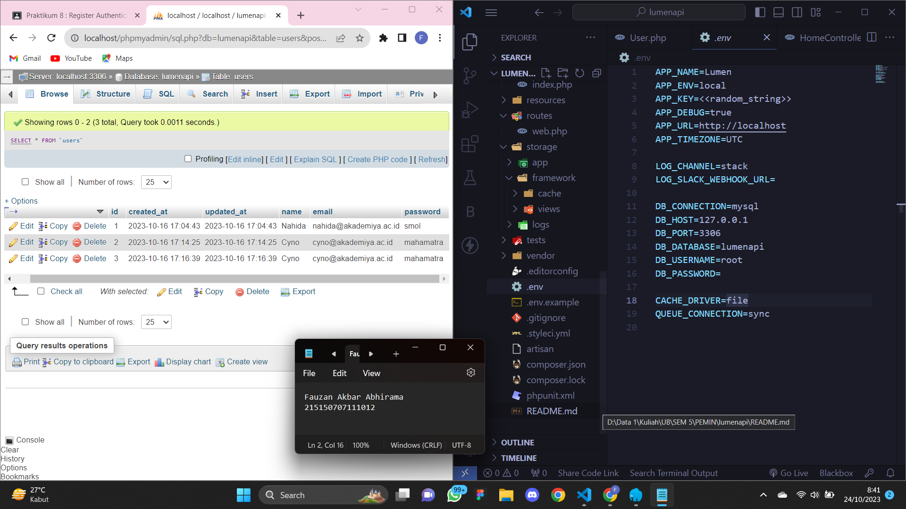<br/><br />
2. Pastikan terdapat model User.php yang digunakan pada bab 5 Model, Controller
dan Request-Response Handler. Berikut baris kode yang harus ada
```
<?php
namespace App\Models;
use Illuminate\Database\Eloquent\Model;
class User extends Model
{
/**
* The attributes that are mass assignable.
*
* @var array
*/
protected $fillable = [
'name', 'email', 'password'
];
/**
* The attributes excluded from the model's JSON form.
*
* @var array
*/
protected $hidden = [];
}
```
Screenshot : <br />
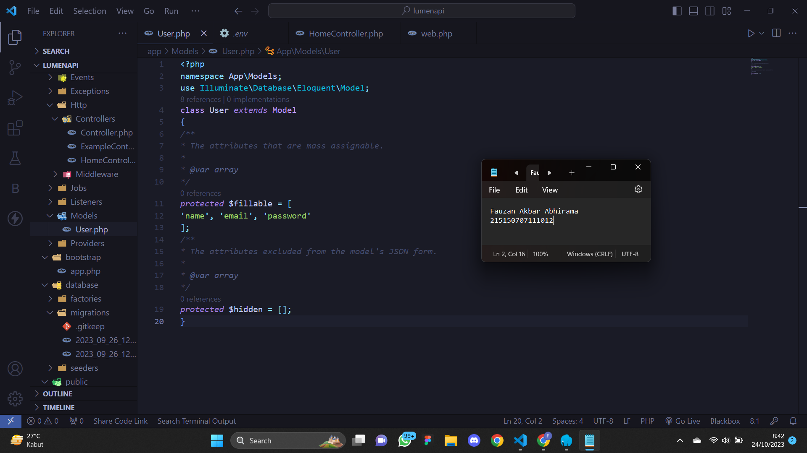<br/>
3. Buatlah file AuthController.php dan isilah dengan baris kode berikut<br />
```
<?php
namespace App\Http\Controllers;
use App\Models\User;
use Illuminate\Http\Request;
use Illuminate\Support\Facades\Hash;
class AuthController extends Controller
{
/**
* Create a new controller instance.
*
* @return void
*/
public function __construct()
{
//
}
//
public function register(Request $request)
{
$name = $request->name;
$email = $request->email;
$password = Hash::make($request->password);
$user = User::create([
'name' => $name,
'email' => $email,
'password' => $password
]);
return response()->json([
'status' => 'Success',
'message' => 'new user created',
'data' => [
'user' => $user,
]
],200);
}
}
```
Screenshot : <br />
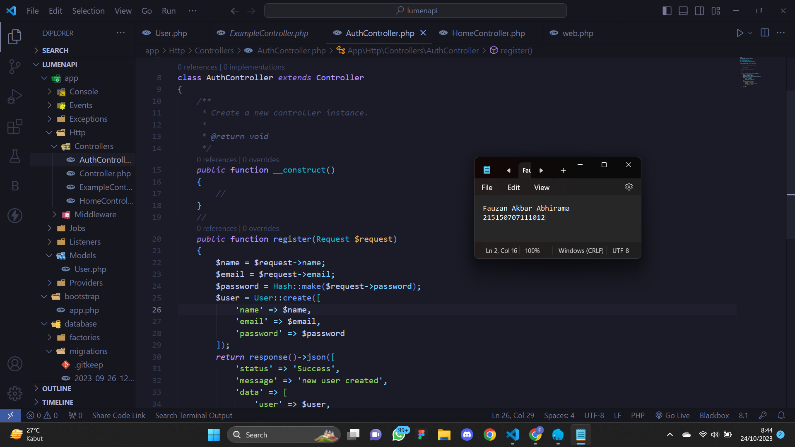<br/><br />
4. Tambahkan baris berikut pada routes/web.php<br />
Source Code:
```
<?php
...
$router->group(['prefix' => 'auth'], function () use ($router) {
$router->post('/register', ['uses'=> 'AuthController@register']);
});
```
Screenshot : <br />
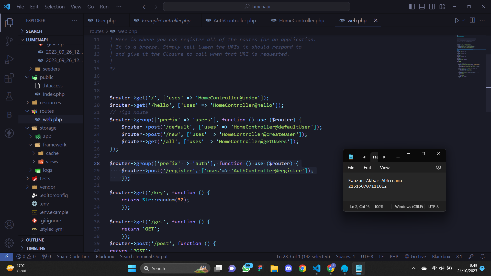<br/>
5. Jalankan aplikasi pada endpoint /auth/register dengan body berikut
Source Code:
```
{
"name": "Scaramouche",
"email": "scaramouche@fatui.org",
"password": "wanderer"
}
```
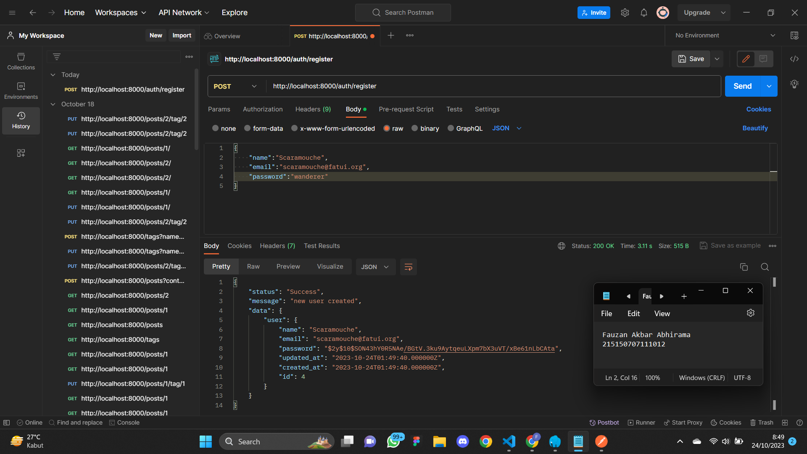<br/>
## Authentication<br />
1. Buatlah fungsi login(Request $request) pada file AuthController.php
Source Code:
```
<?php
namespace App\Http\Controllers;
use App\Models\User;
use Illuminate\Http\Request;
use Illuminate\Support\Facades\Hash;
class AuthController extends Controller
{
...
public function login(Request $request)
{
	$email = $request->email;
$password = $request->password;
$user = User::where('email', $email)->first();
if (!$user) {
return response()->json([
'status' => 'Error',
'message' => 'user not exist',
],404);
}
if (!Hash::check($password, $user->password)) {
return response()->json([
'status' => 'Error',
'message' => 'wrong password',
],400);
}
return response()->json([
'status' => 'Success',
'message' => 'successfully login',
'data' => [
'user' => $user,
]
],200);
}
}
```
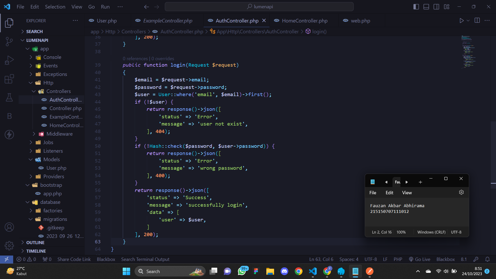<br/>
2. Tambahkan baris berikut pada routes/web.php<br />
Source Code:
```
<?php
...
$router->group(['prefix' => 'auth'], function () use ($router) {
$router->post('/register', ['uses'=> 'AuthController@register']);
$router->post('/login', ['uses'=> 'AuthController@login']); // route login
});
```
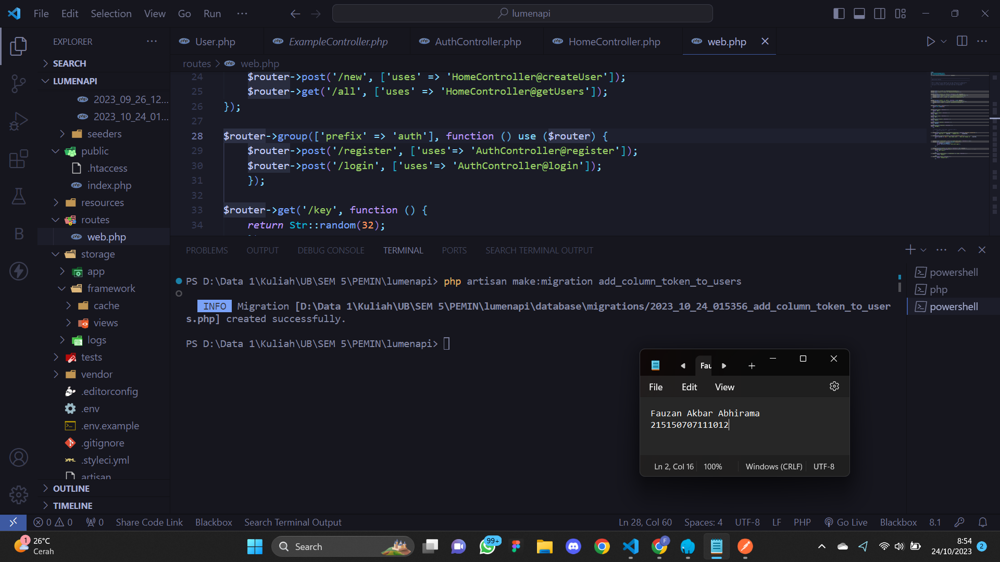<br/>
3. Jalankan aplikasi pada endpoint /auth/login dengan body berikut
Source Code:
```
{
"email": "scaramouche@fatui.org",
"password": "wanderer"
}
```
<br/>
Opsional : lakukan percobaan dengan menyalahkan email atau password dan amati responnya. <br>
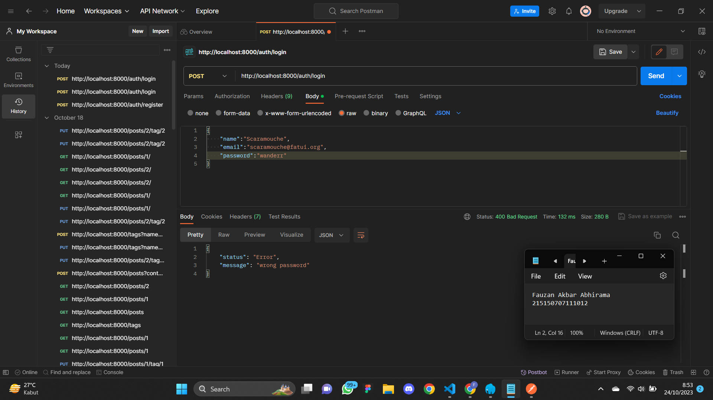<br/>
## Token
1. Jalankan perintah berikut untuk membuat migrasi baru<br/>
Source Code:
```
php artisan make:migration add_column_token_to_users
```
Screenshot : <br />
<br/><br />
2. Tambahkan baris berikut pada migration yang baru terbuat<br />
Source Code:
```
<?php
use Illuminate\Database\Migrations\Migration;
use Illuminate\Database\Schema\Blueprint;
use Illuminate\Support\Facades\Schema;
class AddColumnTokenToUsers extends Migration
{
/**
* Run the migrations.
*
* @return void
*/
public function up()
{
Schema::table('users', function (Blueprint $table) {
$table->string('token', 72)->unique()->nullable(); //
});
}
/**
* Reverse the migrations.
*
* @return void
*/
public function down()
{
Schema::table('users', function (Blueprint $table) {
$table->dropIfExists('token'); //
});
}
}
```
Screenshot : <br />
<br/>
3. Tambahkan atribut token di $fillable pada User.php<br/>
Source Code:
```
<?php
namespace App\Models;
use Illuminate\Database\Eloquent\Model;
class User extends Model
{
/**
* The attributes that are mass assignable.
*
* @var array
*/
protected $fillable = ['name', 'email', 'password',
'token' //
];
/**
* The attributes excluded from the model's JSON form.
*
* @var array
*/
protected $hidden = [];
}
```
Screenshot : <br />
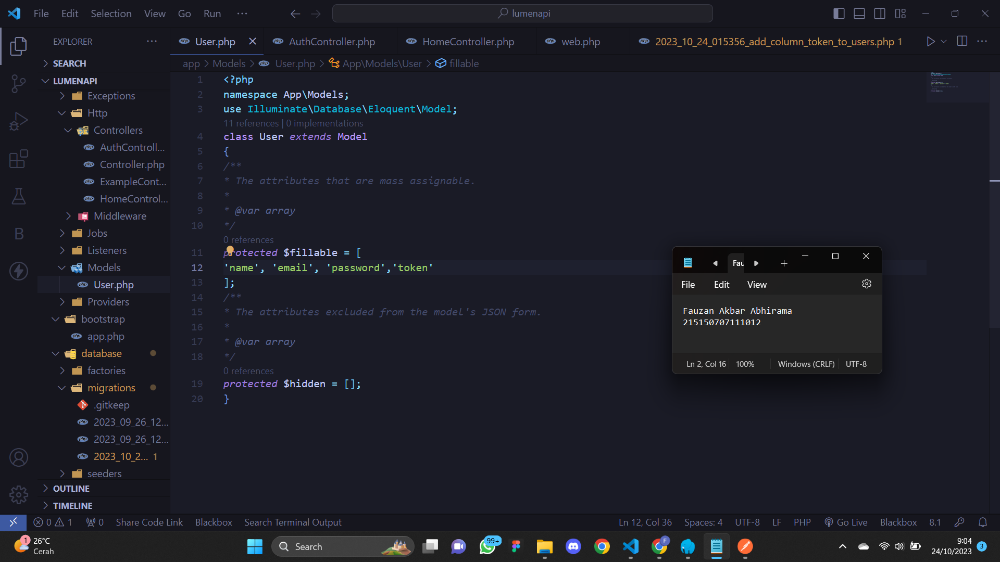<br/>

4. Tambahkan baris berikut pada file AuthController.php<br />
```
<?php
namespace App\Http\Controllers;
use App\Models\User;
use Illuminate\Http\Request;
use Illuminate\Support\Facades\Hash;
use Illuminate\Support\Str;
class AuthController extends Controller
{
...
public function login(Request $request)
{
$email = $request->email;
$password = $request->password;
$user = User::where('email', $email)->first();
if (!$user) {
return response()->json([
'status' => 'Error',
'message' => 'user not exist',
],404);
}
if (!Hash::check($password, $user->password)) {
return response()->json([
'status' => 'Error',
'message' => 'wrong password',
],400);
}
$user->token = Str::random(36); //
$user->save(); //return response()->json([
'status' => 'Success',
'message' => 'successfully login',
'data' => [
'user' => $user,
]
],200);
}
}
```
Screenshot : <br />
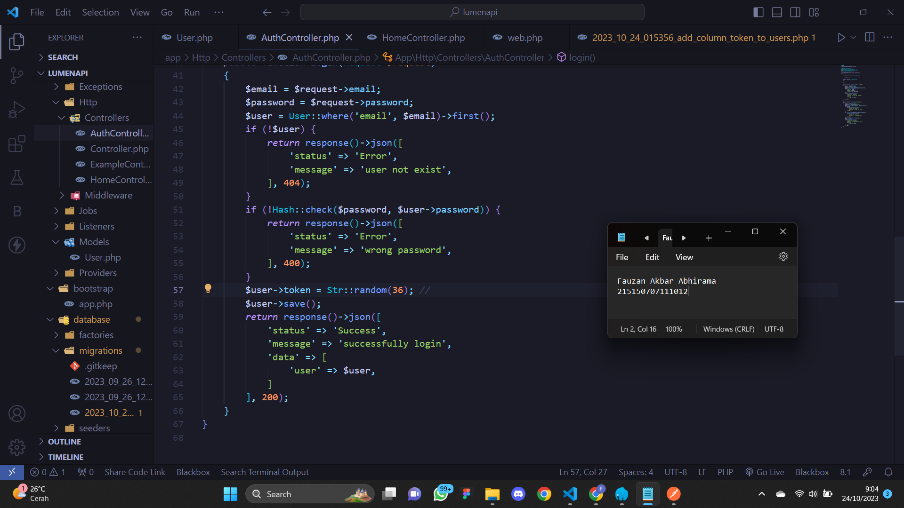<br/>
5. Jalankan perintah di bawah untuk menjalankan migrasi terbaru<br />
```
php artisan migrate
```
Screenshot : <br />
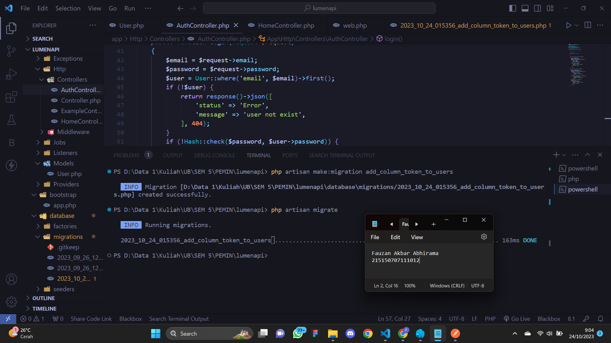<br/>
6. Jalankan aplikasi pada endpoint /auth/login dengan body berikut. Salinlah token
yang didapat ke notepad<br/>
```
{
"email": "scaramouche@fatui.org",
"password": "wanderer"
}
```
Screenshot : <br />
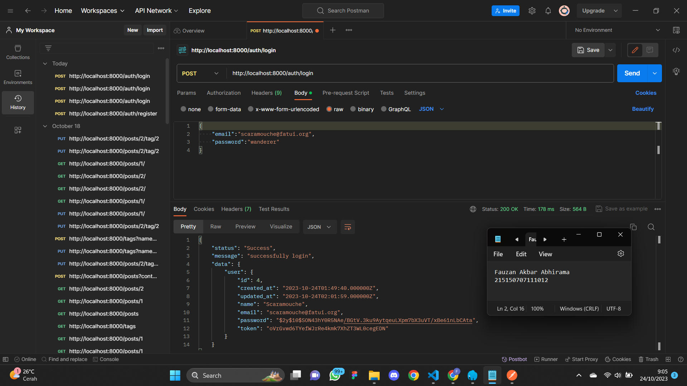<br/>
<br/>

## Authorization
1. Buatlah file Authorization.php pada folder App/Http/Middleware dan isilah dengan
baris berikut<br />

Source Code:
```
<?php
namespace App\Http\Middleware;
use App\Models\User;
use Closure;
class Authorization
{
/**
* Handle an incoming request.*
* @param \Illuminate\Http\Request $request
* @param \Closure $next
* @return mixed
*/
public function handle($request, Closure $next)
{
$token = $request->header('token') ?? $request->query('token');
if (!$token) {
return response()->json([
'status' => 'Error',
'message' => 'token not provided',
],400);
}
$user = User::where('token', $token)->first();
if (!$user) {
return response()->json([
'status' => 'Error',
'message' => 'invalid token',
],400);
}
$request->user = $user;
return $next($request);
}
}
```

Screenshot : <br />
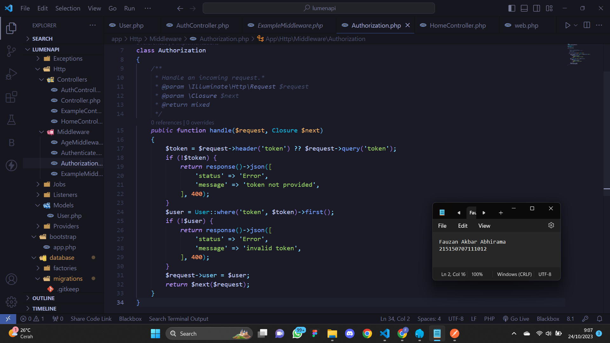<br/>
2. Tambahkan middleware yang baru dibuat pada bootstrap/app.php.<br />
Source Code:
```
/*
|--------------------------------------------------------------------------
| Register Middleware
|--------------------------------------------------------------------------
|
| Next, we will register the middleware with the application. These can
| be global middleware that run before and after each request into a
| route or middleware that'll be assigned to some specific routes.
|
*/
// $app->middleware([
// App\Http\Middleware\ExampleMiddleware::class
// ]);
$app->routeMiddleware([
'auth' => App\Http\Middleware\Authorization::class, //
]);
```

Screenshot : <br />
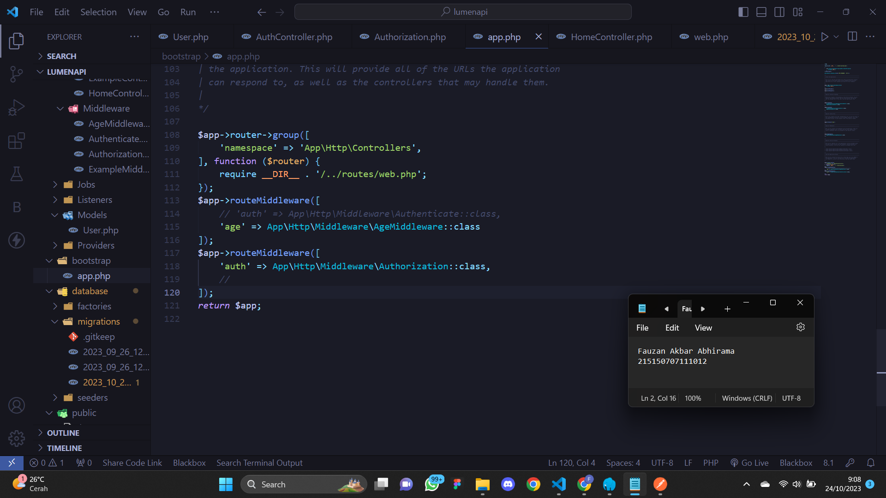<br/>

3. Buatlah fungsi home() pada HomeController.php<br>


Source Code:
```
<?php
namespace App\Http\Controllers;
use App\Models\User; // import model User
use Illuminate\Http\Request;
use Illuminate\Http\Response;
class HomeController extends Controller
{
...
public function home(Request $request)
{
$user = $request->user;
return response()->json([
'status' => 'Success',
'message' => 'selamat datang ' . $user->name,
],200);
}
}
```
Screenshot : <br />
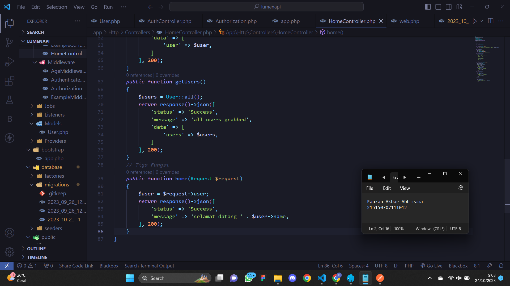<br/>

4. Tambahkan baris berikut pada routes/web.php<br>


Source Code:
```
<?php

$router->get('/', ['uses' => 'HomeController@index']);
$router->get('/hello', ['uses' => 'HomeController@hello']);
$router->get('/home', ['middleware' => 'auth','uses' => 'HomeController@home']); //
...
```
Screenshot : <br />
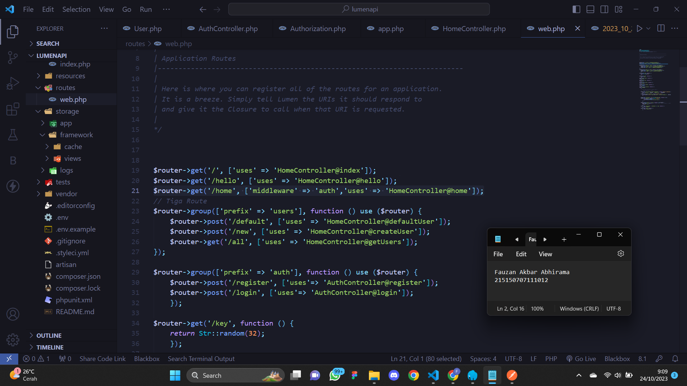<br/>

5. Jalankan aplikasi pada endpoint /home dengan melampirkan nilai token yang
didapat setelah login pada header<br>

Screenshot : <br />
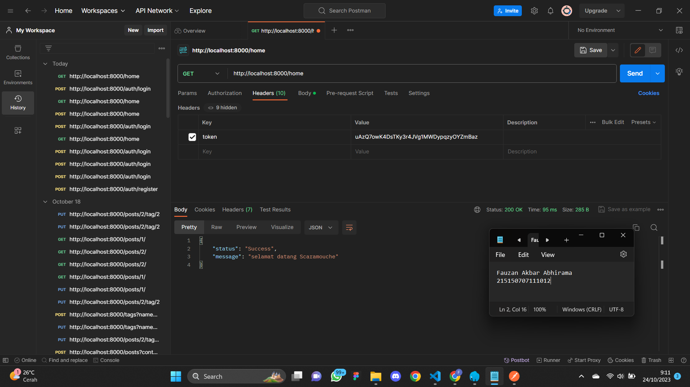<br/>


